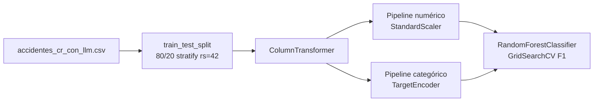
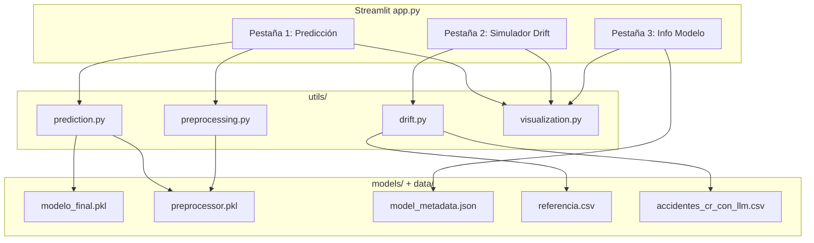

# Plan de Implementación — Fase 3 (Proyecto 3)

## 1. Hallazgos inferidos del análisis automático

### Fuente analizada

- Notebook: `[proyecto__3_grupo_b.py](proyecto__3_grupo_b.py)` (exportado desde Google Colab)
- Dataset final: `[accidentes_cr_con_llm.csv](accidentes_cr_con_llm.csv)` — **43,946 filas × 17 columnas**

### Variable objetivo (target)


| Campo          | Valor inferido                                                                                  |
| -------------- | ----------------------------------------------------------------------------------------------- |
| Columna        | `clase_bin`                                                                                     |
| Tipo           | Binaria (0/1)                                                                                   |
| Definición     | `1` si `Clase` contiene `"muert"` o `"grave"`; `0` en caso contrario                            |
| Interpretación | **1 = accidente con muertos/heridos graves** (clase minoritaria de interés); **0 = solo leves** |
| Nota           | Corrección explícita en el notebook: la minoritaria se etiqueta como positiva                   |


### Variables predictoras del modelo final (16 features)

El modelo de producción usa el dataset **Con LLM** (`X_llm = df2.drop('clase_bin')`):

**Numéricas (4)** — `StandardScaler`:

- `Kilometro_num` (float, km de ruta)
- `fin_semana` (int 0/1)
- `severidad_tipo_LLM` (int 1–10, score Gemini por `tipo_colision`)
- `cobertura_emergencias_canton` (int 1–10, score Gemini por `Cantón`)

**Categóricas (12)** — `TargetEncoder`:

- `Provincia`, `Cantón`, `region`, `Rural_urbano`, `Calzada_vertical`, `Calzada_horizontal`, `hora_grupo`, `estacion`, `calzada_tipo`, `estado_via`, `clima_grupo`, `tipo_colision`

Columnas excluidas del modelo: `clase_bin` (target), `Clase` (eliminada antes del entrenamiento), `Año`, `ruta_tipo` (eliminadas en limpieza).

### Transformaciones aplicadas en entrenamiento




**Preprocesamiento de datos original** (ya aplicado en el CSV):

- Texto en minúsculas; limpieza de ruido (`desconocido`, etc. → NaN)
- Derivación de `fin_semana`, `estacion`, `calzada_tipo`, `estado_via`, `clima_grupo`, `tipo_colision`, `region`
- Eliminación de filas con NaN
- Enriquecimiento LLM: `severidad_tipo_LLM` y `cobertura_emergencias_canton`

**Pipeline ML** (reproducible):

```python
# Inferido de líneas 894-907 y 959-962
numeric_transformer = Pipeline([('scaler', StandardScaler())])
categorical_transformer = Pipeline([('target_enc', TargetEncoder())])
preprocessor = ColumnTransformer([
    ('num', numeric_transformer, numeric_features),
    ('cat', categorical_transformer, categorical_features)
])
# fit: preprocessor.fit_transform(X_train, y_train)
# infer: preprocessor.transform(X_new)  # sin y
```

### Algoritmos entrenados


| Fase    | Modelos                                                                                                        | Hiperparámetros clave                                                                  |
| ------- | -------------------------------------------------------------------------------------------------------------- | -------------------------------------------------------------------------------------- |
| Sin LLM | Logistic Regression, Ridge (LogisticRegressionCV L2), Decision Tree, Random Forest, XGBoost, Voting Classifier | `class_weight='balanced'`; GridSearchCV con `scoring='f1'`; XGB con `scale_pos_weight` |
| Con LLM | Mismos + **MLP** (64,32)                                                                                       | Misma configuración; split idéntico (`random_state=42`)                                |


**Ensamblaje identificado**: `VotingClassifier(voting='soft')` con LR + RF + XGB. **No seleccionado para producción** (mayor Accuracy ~0.778 pero peor F1/Recall).

### Métricas utilizadas

- `accuracy_score`, `precision_score`, `recall_score`, `f1_score`, `roc_auc_score`
- `classification_report`, `confusion_matrix`
- Criterio de selección: **F1-Score** (desbalance de clases)

### Mejor modelo y modelo de producción


| Atributo                | Valor inferido                                                                       |
| ----------------------- | ------------------------------------------------------------------------------------ |
| **Modelo seleccionado** | **Random Forest (Con LLM)** — `best_rf2`                                             |
| F1-Score                | **0.4225** (mejor global)                                                            |
| ROC-AUC                 | **0.7376**                                                                           |
| Comparación             | Ridge Con LLM: F1=0.4220, AUC=0.7402; RF Sin LLM: F1=0.4212                          |
| GridSearch RF           | `n_estimators=[50,100]`, `max_depth=[5,10,None]`, `min_samples_split=[5,10]`, `cv=3` |
| Tamaño entrenamiento    | ~35,157 filas (80% de 43,946)                                                        |
| Tamaño prueba           | ~8,789 filas (20%)                                                                   |


**Brecha crítica detectada**: el notebook **no serializa** modelos (`joblib`/`pickle` ausentes). Los `.pkl` deben generarse en la Fase 3 mediante un script de entrenamiento reproducible antes de desplegar la app.

---

## 2. Estructura de carpetas objetivo

```
Aplicación_Interactiva_Proyecto_3/
├── app.py                          # Entry point Streamlit (3 pestañas)
├── models/
│   ├── modelo_final.pkl            # best_rf2 entrenado
│   ├── preprocessor.pkl            # ColumnTransformer completo
│   ├── scaler.pkl                  # StandardScaler extraído del preprocessor
│   └── model_metadata.json         # Métricas, matriz confusión, importancias, fecha
├── data/
│   ├── accidentes_cr_con_llm.csv   # Copia del dataset actual
│   └── referencia.csv              # Subconjunto de referencia (X_train sin target)
├── utils/
│   ├── drift.py                    # PSI, KS, mean/std drift, score global
│   ├── prediction.py               # Carga artefactos, predict, SHAP
│   ├── preprocessing.py            # Feature schema, validación, transform
│   └── visualization.py            # Plotly: histogramas, box, KDE, semáforo
├── scripts/
│   └── train_model.py              # Re-entrena y exporta artefactos + referencia.csv
├── requirements.txt
└── README.md
```

El script `scripts/train_model.py` replica exactamente la lógica del notebook (líneas 880–964) para garantizar reproducibilidad y poblar `models/` y `data/referencia.csv`.

---

## 3. Dependencias (`requirements.txt`)


| Paquete             | Uso                                                                                               |
| ------------------- | ------------------------------------------------------------------------------------------------- |
| `streamlit`         | UI interactiva                                                                                    |
| `pandas`, `numpy`   | Datos                                                                                             |
| `scikit-learn`      | Modelo y métricas                                                                                 |
| `scipy`             | KS test (`ks_2samp`)                                                                              |
| `plotly`            | Gráficos interactivos                                                                             |
| `shap`              | Explicabilidad (TreeExplainer para RF)                                                            |
| `joblib`            | Serialización `.pkl`                                                                              |
| `category_encoders` | TargetEncoder (mismo que notebook)                                                                |
| `xgboost`           | Solo requerido por `train_model.py` si se re-entrena todo el benchmark                            |
| `evidently`         | **Opcional** — no necesario para PSI/KS custom; se omitirá salvo valor agregado en reportes batch |


---

## 4. Arquitectura del sistema




**Principio de diseño**: `app.py` solo orquesta UI; toda lógica de negocio vive en `utils/`. Carga de artefactos con `@st.cache_resource` para rendimiento.

---

## 5. Estrategia de carga del modelo

1. `**utils/prediction.py`** — función `load_artifacts()`:
  - Intenta cargar `models/modelo_final.pkl`, `models/preprocessor.pkl`, `models/model_metadata.json`
  - Si falta alguno: retorna estado degradado + mensaje accionable ("Ejecute `python scripts/train_model.py`")
  - Valida compatibilidad de features contra schema en `preprocessing.py`
2. `**utils/preprocessing.py**` — schema inferido del CSV:
  - `FEATURE_SCHEMA`: tipo UI por variable (slider / selectbox / dropdown)
  - `build_input_dataframe(user_inputs) → DataFrame 1 fila`
  - `transform_input(df, preprocessor) → ndarray`
  - Validaciones: rangos numéricos, categorías fuera de vocabulario → warning + clip/fallback
3. **Flujo de predicción**:
  ```
   inputs UI → DataFrame raw → preprocessor.transform → modelo.predict / predict_proba
   → etiqueta (Leve/Grave) + probabilidad + explicación textual
  ```
4. `**scaler.pkl**`: extraído en entrenamiento como:
  `preprocessor.named_transformers_['num'].named_steps['scaler']` — útil para drift numérico y documentación; el preprocessor completo sigue siendo la fuente de verdad para inferencia.

---

## 6. Estrategia de cálculo de drift

**Comparación**: `referencia.csv` (baseline = split de entrenamiento, 80%) vs copia alterada del dataset completo o muestra.

### Métricas por feature (tiempo real en Pestaña 2)


| Métrica                | Implementación en `drift.py`                                                                                                                                |
| ---------------------- | ----------------------------------------------------------------------------------------------------------------------------------------------------------- |
| **PSI**                | Bins por cuantiles del reference; fórmula estándar Σ (act-ref)*ln(act/ref)                                                                                  |
| **KS**                 | `scipy.stats.ks_2samp` (numéricas); para categóricas: distancia de distribución de frecuencias                                                              |
| **Δ Media**            | `(mean_altered - mean_ref) / std_ref`                                                                                                                       |
| **Δ Std**              | `(std_altered - std_ref) / std_ref`                                                                                                                         |
| **Drift Score global** | Promedio ponderado de PSI normalizado por feature (peso mayor en numéricas críticas: `severidad_tipo_LLM`, `cobertura_emergencias_canton`, `Kilometro_num`) |


### Semáforo de riesgo (por feature y global)


| Color    | PSI           | Mensaje                                    |
| -------- | ------------- | ------------------------------------------ |
| VERDE    | `< 0.10`      | "Distribución estable"                     |
| AMARILLO | `0.10 – 0.25` | "Existe evidencia moderada de drift"       |
| ROJO     | `≥ 0.25`      | "Modelo fuera de dominio de entrenamiento" |


### Controles del "auditor/villano" (Pestaña 2)

Operan sobre **copia en memoria** de `accidentes_cr_con_llm.csv` (sin modificar archivo original):


| Control                    | Efecto                                                         |
| -------------------------- | -------------------------------------------------------------- |
| Desplazamiento de medias   | `x' = x + delta` en numéricas seleccionadas                    |
| Aumento de desviación      | `x' = mean + (x-mean)*factor`                                  |
| Inyección de ruido         | `x' = x + N(0, sigma)`                                         |
| Categorías raras           | Sub-muestreo/inflado de categorías de baja frecuencia          |
| Alteración de proporciones | Re-weighting o permutación dirigida de frecuencias categóricas |


Cada cambio recalcula métricas de drift y actualiza visualizaciones before/after.

---

## 7. Diseño de la interfaz (Streamlit)

**Estilo**: layout wide, sidebar con navegación, CSS custom (tipografía, cards, badges de semáforo), iconografía consistente.

### Pestaña 1 — Predicción Individual (prioritaria)

- **Sidebar/controles**: 16 inputs auto-detectados:
  - Sliders: `Kilometro_num`, `severidad_tipo_LLM`, `cobertura_emergencias_canton`
  - Selectbox binario: `fin_semana` (0/1)
  - Selectbox/dropdown: resto categóricas (Cantón con búsqueda si >20 valores)
- **Panel central**: badge de predicción (Leve/Grave), gauge de probabilidad Plotly
- **Explicación**: texto interpretable + bar chart de importancia global del RF
- **SHAP** (si modelo cargado): waterfall/bar de contribuciones por feature (`shap.TreeExplainer`)
- Recálculo instantáneo con `@st.cache_data` invalidado por hash de inputs

### Pestaña 2 — Simulador de Drift

- Panel de controles globales de alteración
- Tabla resumen: PSI, KS, Δμ, Δσ por variable con semáforo
- Drift Score global + mensaje explicativo
- Gráficos Plotly side-by-side: histograma, boxplot, KDE (numéricas); barras de frecuencia (categóricas)
- Tabla comparativa before/after (media, std, top categorías)

### Pestaña 3 — Información del Modelo

- Nombre: Random Forest (Con LLM)
- Métricas reconstruidas desde `model_metadata.json` (generado por `train_model.py`):
  - Accuracy, Precision, Recall, F1, ROC-AUC
  - Matriz de confusión (heatmap Plotly)
  - Curva ROC
  - Importancia de variables (bar chart)
  - N° features: 16
  - Tamaño entrenamiento: ~35,157
  - Fecha de entrenamiento: timestamp del script
  - Hiperparámetros GridSearch ganadores

---

## 8. Módulos a desarrollar


| Módulo                                                       | Responsabilidades                                                                       |
| ------------------------------------------------------------ | --------------------------------------------------------------------------------------- |
| `[scripts/train_model.py](Aplicación_Interactiva_Proyecto_3/scripts/train_model.py)` | Reproduce entrenamiento RF+LLM; exporta `.pkl`, `referencia.csv`, `model_metadata.json` |
| `[utils/preprocessing.py](Aplicación_Interactiva_Proyecto_3/utils/preprocessing.py)` | Schema de features, defaults desde mediana/modas de referencia, validación              |
| `[utils/prediction.py](Aplicación_Interactiva_Proyecto_3/utils/prediction.py)`       | Carga lazy, predict, predict_proba, explicación textual, SHAP                           |
| `[utils/drift.py](Aplicación_Interactiva_Proyecto_3/utils/drift.py)`                 | Alteraciones de dataset, PSI, KS, deltas, score global, semáforo                        |
| `[utils/visualization.py](Aplicación_Interactiva_Proyecto_3/utils/visualization.py)` | Plotly helpers reutilizables (KDE, box, confusion matrix, ROC, semáforo)                |
| `[app.py](Aplicación_Interactiva_Proyecto_3/app.py)`                                 | 3 tabs, manejo de errores, estado de sesión para dataset alterado                       |


---

## 9. Posibles riesgos y mitigaciones


| Riesgo                                         | Mitigación                                                            |
| ---------------------------------------------- | --------------------------------------------------------------------- |
| Modelos `.pkl` inexistentes                    | Script `train_model.py` + mensaje UI con instrucciones                |
| TargetEncoder con categorías nuevas en UI      | Validar contra vocabulario de entrenamiento; warning si OOV           |
| SHAP lento en cada cambio                      | Cache + cálculo bajo demanda con botón "Calcular explicación"         |
| Cantón con ~80+ valores                        | `st.selectbox` con opción de filtrado; defaults sensatos              |
| PSI inestable en bins vacíos                   | Smoothing epsilon (1e-4) en proporciones                              |
| Dependencia Colab (`google.colab`) en notebook | No incluir en app; solo lógica ML portable                            |
| Desbalance extremo → probabilidades sesgadas   | Mostrar advertencia en UI sobre baja recall histórica (~del metadata) |
| OneDrive/rutas con espacios                    | Paths relativos con `pathlib.Path(__file__).parent`                   |


---

## 10. Validaciones necesarias

**Pre-despliegue (script de entrenamiento)**:

- Reproducir F1 ≈ 0.4225 ± tolerancia (±0.005) con `random_state=42`
- Verificar shapes: preprocessor output = n_features del RF
- Confirmar 16 columnas en `referencia.csv`

**En la aplicación**:

- Inputs fuera de rango → bloqueo con mensaje amigable
- Archivos faltantes → modo degradado por pestaña (drift funciona sin modelo; predicción muestra error claro)
- Dataset alterado nunca persiste sobre CSV original
- Probabilidades en [0,1]; suma de clases = 1

**Smoke test manual**:

```bash
cd Aplicación_Interactiva_Proyecto_3
python scripts/train_model.py
streamlit run app.py
```

---

## 11. Entregables y orden de ejecución (Fase 3 — post-aprobación)

1. Crear estructura `Aplicación_Interactiva_Proyecto_3/` y copiar `accidentes_cr_con_llm.csv` → `data/`
2. Implementar `scripts/train_model.py` → generar artefactos en `models/` y `data/referencia.csv`
3. Implementar módulos `utils/` (con comentarios en español)
4. Implementar `app.py` con 3 pestañas
5. Redactar `README.md` con instrucciones exactas:
  ```bash
   pip install -r requirements.txt
   python scripts/train_model.py
   streamlit run app.py
  ```
6. Validar métricas reconstruidas vs notebook

**Nota sobre `implementation_plan`**: este documento es el plan maestro; tras su aprobación se materializará también como archivo markdown en el repositorio si se desea persistencia explícita del nombre solicitado.
